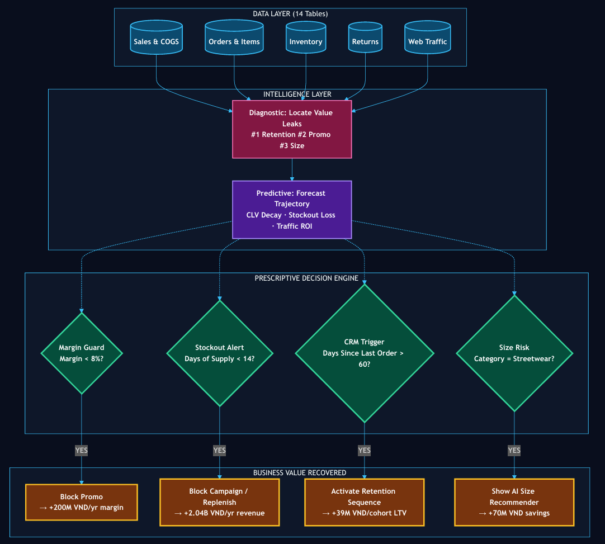
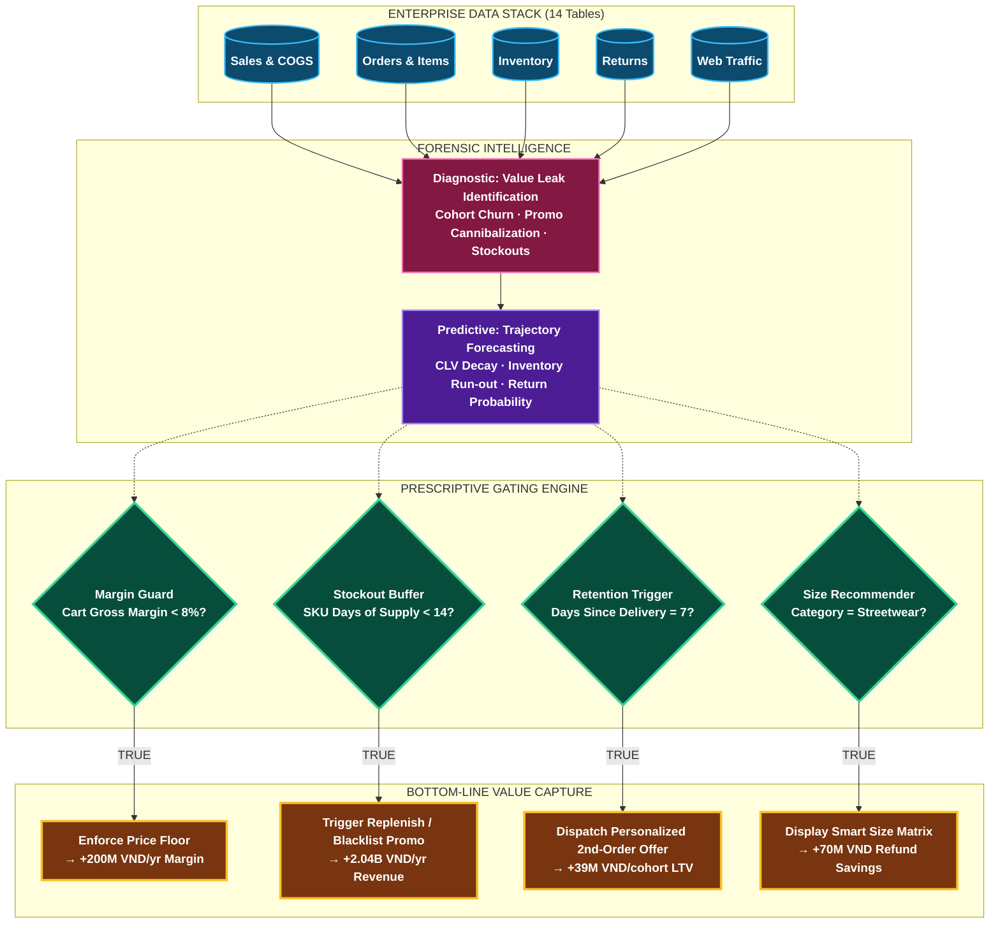
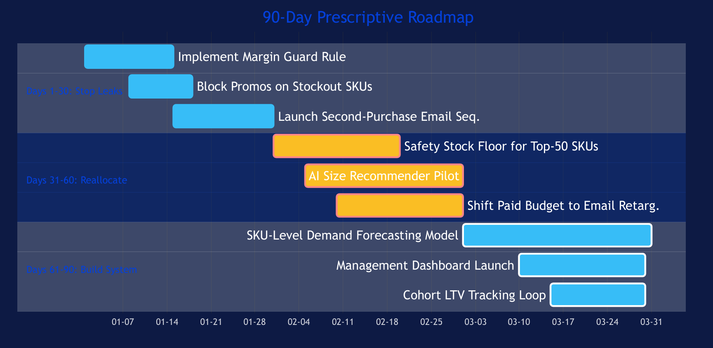
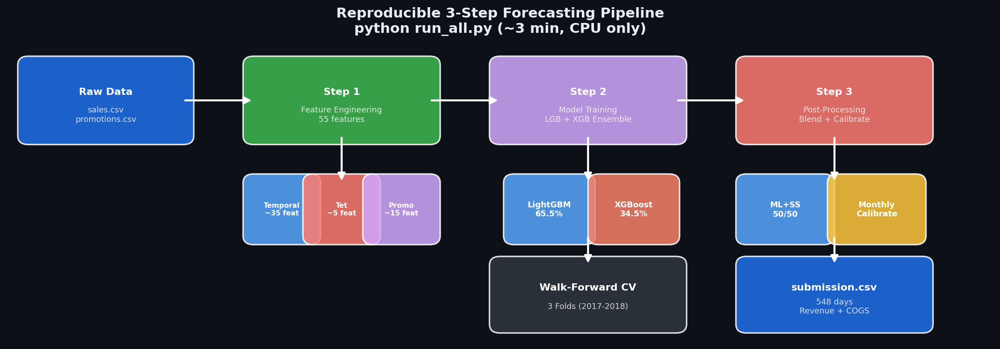
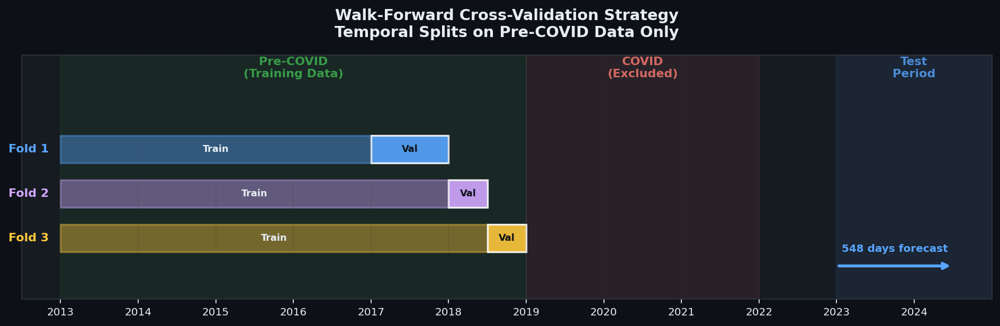
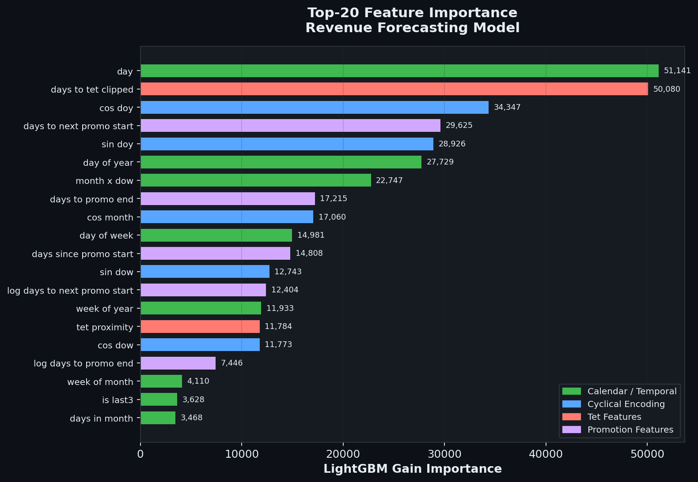
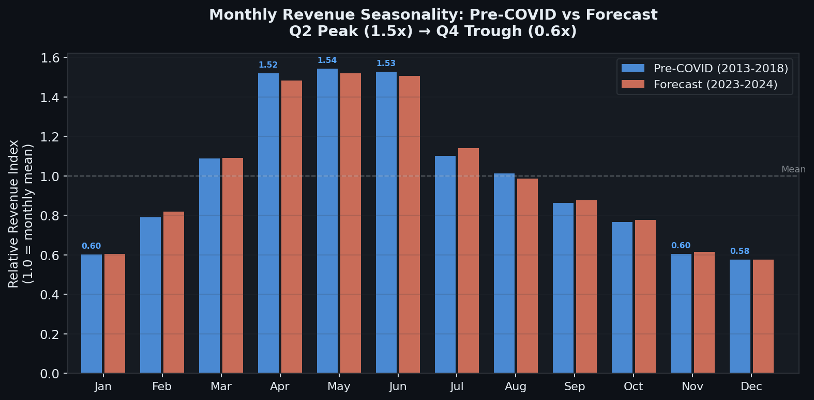

# Revenue Leakage Forensics & ML Forecasting Audit — E-Commerce Platform

<p align="center">
  
</p>

<p align="center">
  <a href="https://drive.google.com/file/d/1OJq7Tnw2sbJcFC2gpMVIun16izk2XMcd/view?usp=sharing"></a>
  <a href="https://www.facebook.com/share/1BkTVoc7og/"></a>
  
  
  
</p>

---

## 🏆 Project Recognition & Executive Overview

This repository contains the complete research report, diagnostic visual gallery, and end-to-end Machine Learning pipeline submitted by **Team ReelScroller** for **Datathon 2026 — "The Gridbreakers"**, organized by **VinUniversity DS&AI Club** and **Vintelligence**, in partnership with **Chợ Tốt, CVMAIL, R'STUDIO, and DATAPOT**. 

The submission achieved **Top 9 Placement** in the competition out of nationwide competitive teams.

* 📜 **Official Research Paper (PDF)**: [ReelScroller_Report.pdf (Google Drive)](https://drive.google.com/file/d/1OJq7Tnw2sbJcFC2gpMVIun16izk2XMcd/view?usp=sharing)
* 📢 **Award Announcement**: [Facebook Official Post](https://www.facebook.com/share/1BkTVoc7og/)

### The Core Premise: Revenue Leakage Forensics
Across 14 linked relational enterprise datasets spanning 2012–2022 (representing **646,945 orders**, **90,246 unique customers**, **714,669 order-item records**, **39,939 returns**, and **60,247 inventory daily snapshots**), standard surface-level metrics obscured severe underlying commercial failures. While the platform reported an apparent **~96% fill rate** and rapid customer acquisition, forensic unit-economic analysis revealed a platform trapped on a customer treadmill.

The platform does **not** suffer from a customer acquisition deficiency; it suffers from a **compound value-leakage crisis** draining **2.5B – 4.5B VND annually** across five operational nodes:
1. **The Retention Cliff**: Year+1 cohort retention collapsed from **65% to 7%** (a 9× degradation); customer lifetime value (CLV) dropped **-24,406 VND/year**, crossing zero by 2023 ($CAC > LTV$).
2. **The Promo Paradox**: Discounted lines destroyed **93% of gross margin** (falling from 20.0% to 1.3%), including a disastrous **-40.1% gross margin month** in August 2021.
3. **The Wrong-Size Tax**: Sizing issues constituted **35% of all returns** (176.7M VND refunded), with **79% concentrated in Streetwear** during summer collection rollouts.
4. **Stockout Bleeding**: A chronic **67.3% daily SKU stockout rate** drained **4.44B VND** in lost sales, completely hidden by unit fill rates.
5. **The Traffic Quality Illusion**: Web traffic rose while revenue-per-session declined ($r = 0.32$), driven by vanity paid-search spend rather than high-intent email/mobile channels.

In parallel, we designed an ultra-lightweight, zero-leakage **Machine Learning Revenue & COGS Forecasting Pipeline** for 548 days (01/01/2023 – 01/07/2024), achieving **~665k MAE** through Pre-COVID regime isolation, 55 domain features (Vietnamese Tet dynamics, cyclical encodings, payday spikes), and a LightGBM + XGBoost Nelder-Mead ensemble.

---

## 📂 Repository Architecture

```text
ecom-revenue-forecasting-audit/
├── assets/
│   └── Top9.png                                # Datathon 2026 Certificate of Appreciation
├── README.md                                   # Comprehensive Project Dossier (this document)
├── requirement.txt                             # Locked Python dependencies
├── part2-DA/                                   # PART 2: Business Analytics & Strategic Audit
│   ├── Latex/                                  # NeurIPS-style camera-ready paper source
│   │   ├── main.tex                            # Complete 11-page scientific manuscript
│   │   ├── charts/                             # Vector-quality exported figures
│   │   └── Styles/neurips_2025.sty             # Publication style template
│   ├── charts/                                 # 26 High-resolution diagnostic charts (160 DPI)
│   │   ├── 1a_cohort_heatmap.png ... 1d_clv_decay_forecast.png
│   │   ├── 2a_promo_margin_collapse.png ... 2d_promo_channel_efficiency.png
│   │   ├── 3a_returns_stacked_forecast.png ... 3d_wrongsize_seasonal_heatmap.png
│   │   ├── 4a_stockout_bleeding.png ... 4d_stockout_roi_waterfall.png
│   │   ├── 5a_traffic_quality_matrix.png ... 5d_device_source_orders.png
│   │   ├── prescriptive_engine.png             # Decision Engine Flowchart
│   │   ├── 90_day_roadmap.png                  # Gantt Implementation Roadmap
│   │   ├── pipeline_architecture.png           # ML System Blueprint
│   │   ├── walkforward_cv_timeline.png         # Walk-forward validation splits
│   │   ├── feature_importance_top20.png        # Feature gain hierarchy
│   │   └── monthly_revenue_shape.png           # Monthly seasonality validation
│   ├── reports/
│   │   └── MASTER_REPORT_NeurIPS.md            # Markdown transcript of the research paper
│   └── src/                                    # Chart generation and diagnostic scripts
│       ├── charts_insight1_cohort.py           # Cohort retention, survival curves, CLV
│       ├── charts_insight2_3.py                # Promo economics, margin drops, return analysis
│       ├── charts_insight4_5.py                # Inventory stockout loss, web session ROI
│       └── check_dims.py                       # Data dimension sanity checks
└── part3-revenue-forecasting-pipeline/         # PART 3: Automated ML Forecasting Pipeline
    ├── run_all.py                              # 🚀 Single-command end-to-end execution (<3 min CPU)
    ├── docs/
    │   └── methodology.md                      # In-depth technical ML design notes
    ├── output/                                 # Submission outputs, OOF predictions, logs
    │   └── submission.csv                      # Final 548-day daily predictions (Revenue & COGS)
    └── src/
        ├── __init__.py
        ├── config.py                           # Central configuration & hyperparameters
        ├── step1_feature_engineering.py        # 55 handcrafted temporal/Tet/promo features
        ├── step2_train_models.py               # Walk-forward CV & LightGBM/XGBoost ensemble
        ├── step3_postprocess.py                # Blending, calibration, and COGS modeling
        └── step4_report_charts.py              # ML validation and feature importance visuals
```

---

## 🔍 Part 2: Revenue Leakage Forensics (Diagnostic & Prescriptive)

Our analysis executes an exhaustive **Descriptive $\to$ Diagnostic $\to$ Predictive $\to$ Prescriptive** methodology across all five operational failure modes. Every calculation is reproducible from the raw CSV data without arbitrary hardcoded figures.

```
       ┌────────────────┐
       │  DESCRIPTIVE   │  What happened? (Raw historical distributions)
       └───────┬────────┘
               ▼
       ┌────────────────┐
       │   DIAGNOSTIC   │  Why did it happen? (Root-cause & segment isolation)
       └───────┬────────┘
               ▼
       ┌────────────────┐
       │   PREDICTIVE   │  What will happen? (OLS & cohort forward projections)
       └───────┬────────┘
               ▼
       ┌────────────────┐
       │  PRESCRIPTIVE  │  What should we do? (Targeted interventions & ROI)
       └────────────────┘
```

---

### Pillar 1: The Retention Cliff — When Growth Becomes a Treadmill

<p align="center">
  
  
</p>
<p align="center">
  
  
</p>

#### 1. Descriptive
Tracking customer order history across 2012–2022 demonstrates that Year+1 customer retention experienced a **systemic 9-fold collapse**:
* **2012 Cohort**: Maintained **65.0%** Year+1 retention, stabilizing at **56.0%** through Year+5.
* **2016 Cohort**: Year+1 retention deteriorated to **21.0%**; Year+3 retention fell to **13.0%**.
* **2021 Cohort**: Year+1 retention hit rock bottom at **7.0%**.

#### 2. Diagnostic
* **The Growth Paradox**: New customer acquisition peaked in 2013 at ~25,000 users. However, retention was already collapsing simultaneously. The business compensated for leaking customers by pouring capital into top-of-funnel acquisition — effectively running on an expensive customer treadmill.
* **Structural Break in Survival Curves**: Comparing cohort eras (2012–2013 Early vs. 2015–2017 Growth vs. 2020–2022 Late) confirms this is not organic drift but a structural breakdown. Early cohorts exhibited enduring brand loyalty; modern cohorts fall immediately below the 30% churn threshold.
* **Channel Shift Root Cause**: After 2018, platform marketing pivoted aggressively into paid performance marketing and social display ads. This attracted bargain hunters with zero brand affinity and a low propensity to repurchase.

#### 3. Predictive
Fitting an Ordinary Least Squares (OLS) regression across cohort lifetime value ($CLV = \text{Total Revenue} / \text{Unique Customers}$) reveals an erosion rate of **−24,406 VND per cohort year**:
$$\text{Cohort CLV}(t) = 358,386 - 24,406 \times (t - 2012)$$
* 2012 Cohort CLV: **358,386 VND** $\to$ 2022 Cohort CLV: **33,098 VND**.
* By 2023, the projected CLV crosses zero, proving that **each newly acquired customer now generates less gross revenue than their acquisition cost ($CAC > LTV$)**.

#### 4. Prescriptive Interventions & ROI
* **Day 1–30**: Deploy automated **Second Purchase Activation** push/email triggers timed exactly 7 days post-delivery, personalized with cross-category recommendations.
* **Day 31–60**: Reallocate 20% of the paid social budget into an email-driven customer referral engine.
* **Quantified Upside**: Elevating 2023 cohort Year+1 retention from 7% to 20% across 1,300 new customers recovers **+39M VND in Year 1 contribution margin per cohort**, compounding year-over-year.

---

### Pillar 2: The Promo Paradox — Sell More, Earn Less

<p align="center">
  
  
</p>
<p align="center">
  
  
</p>

#### 1. Descriptive
Auditing 714,669 line-item transactions categorized by applied promotional discounts exposes direct margin destruction:
* **Full Price (0 Promos, 438,353 items)**: Generated **11.0B VND revenue** with **2.20B VND gross profit**, maintaining a healthy **20.0% gross margin**.
* **Discounted (1 Promo, 276,110 items)**: Generated **5.43B VND revenue** but yielded only **71M VND gross profit** — collapsing margin to a disastrous **1.3%**.
* **Impact**: A single coupon code caused a **93% destruction of gross profit margin** on one-third of the business volume.

#### 2. Diagnostic
* **Loss-Leader Pockets**: The *Casual* apparel category suffers from negative margin outliers, with a median margin of **6.0%** (violating the minimum 8% target floor). By contrast, *GenZ* maintains a **22.0%** median margin due to higher brand equity.
* **Disastrous Campaign Timing**: Overlaying the marketing calendar against gross margins indicates that during major promotional pushes, margins systematically cratered. In August 2021 ("Urban Blowout"), the platform operated at **−40.1% gross margin** — effectively subsidizing customers to deplete warehouse inventory.
* **Channel Cannibalization**: The `all_channels` broadcast strategy drives high top-line gross merchandise value (GMV) but achieves the lowest margins, cannibalizing full-price buyers who intended to buy anyway.

#### 3. Predictive
If promotional volume continues expanding under a 10% annual top-line growth trajectory, cumulative foregone gross margin will exceed **300M VND annually by 2025**.

#### 4. Prescriptive Interventions & ROI
* **Immediate Policy**: Hardcode a programmatic **"Margin Guard"** into the e-commerce checkout engine: any cart combination yielding $<8\%$ line-item gross margin is blocked from discount stacking.
* **Promotional Redesign**: Replace unconstrained percentage discounts (-20%, -30%) with basket-building mechanisms: *Buy-X-Get-Y*, minimum order value (AOV) thresholds, and non-cashback loyalty credits.
* **Quantified Upside**: Shifting discounted item margins from 1.3% back to a modest 5.0% on 5.43B VND in sales generates **+200M VND in recovered gross margin annually**.

---

### Pillar 3: The Wrong-Size Tax — A Preventable Revenue Drain

<p align="center">
  
  
</p>
<p align="center">
  
  
</p>

#### 1. Descriptive
Out of 39,939 processed customer return cases:
* **Wrong Size** represents **35.0% (13,967 returns)**, resulting in **176.7M VND** in direct refund outflows.
* Wrong size returns exceed *Defective* (20.1%) and *Not as Described* (17.6%) combined.

#### 2. Diagnostic
* **Category Concentration**: Sizing returns are overwhelmingly driven by a single category: **Streetwear accounts for 79% (140.4M VND)** of all wrong-size refund costs, compared to Outdoor (15%), Casual (3%), and GenZ (2%). Streetwear fits (oversized, boxy, drop-shoulder) suffer from inconsistent vendor sizing labels.
* **Seasonal Predictability**: Heatmap analysis reveals a persistent return spike during **Q2–Q3 (April through August)**. This correlates exactly with annual summer collection releases where newly onboarded SKUs lack historical customer sizing reviews.

#### 3. Predictive
Without intervention, time-series projections indicate wrong-size refunds will leach an additional **40M – 60M VND** directly from operating cash flow across 2023–2024.

#### 4. Prescriptive Interventions & ROI
* **AI Size Recommender**: Deploy an interactive size recommendation widget on product display pages (PDPs) trained on user measurements and historical brand return rates (matching global e-commerce benchmarks like ASOS and Zalando).
* **Streetwear Prioritization**: Focus size chart calibration and 3D silhouette fitting guides strictly on the top 20 Streetwear SKUs first.
* **Quantified Upside**: A 40% reduction in sizing returns recovers **~70M VND** against historical baselines and permanently preserves **+24M VND/year** in operating income.

---

### Pillar 4: Stockout Bleeding — The Silent Revenue Killer

<p align="center">
  
  
</p>
<p align="center">
  
  
</p>

#### 1. Descriptive
Across 60,247 daily inventory snapshots:
* The platform suffered an average daily SKU **stockout rate of 67.3%** (two-thirds of all active catalog items had zero warehouse stock).
* Despite this, internal operations reported an apparent **~96% fill rate**, creating a dangerous illusion of fulfillment health.
* Conservative lost revenue estimation:
$$\text{Lost Revenue} = \sum (\text{Monthly Revenue} \times \text{Stockout Rate} \times 0.40) = \mathbf{4.44B\text{ VND}}$$

#### 2. Diagnostic
* **The Fill-Rate Fallacy**: The reported 96% fill rate was calculated solely on stocked orders, ignoring missed demand from customers who bounced when items showed "Out of Stock".
* **Category Vulnerability**: The high-growth *GenZ* line experienced stockout peaks of **73%**, while *Streetwear* hovered continuously between **66% and 70%**.
* **SKU Positioning Matrix**: Scatter analysis of sell-through rate versus stockout percentage revealed that high-velocity hero products were chronically under-replenished, stranding high-intent buyers.

#### 3. Predictive
At a 10% annual baseline revenue expansion, ongoing inventory stockouts will cause an estimated **1.8B – 2.2B VND in forfeited sales** over the subsequent 18-month horizon.

#### 4. Prescriptive Interventions & ROI
* **Dynamic Safety Stock Floors**: Enforce an automated replenishment trigger maintaining $\ge 14$ days of supply for the Top-50 revenue-generating SKUs.
* **Campaign Supply Gate**: Implement a strict rule prohibiting marketing campaigns from promoting SKUs with $<7$ days of inventory.
* **Quantified Upside & Waterfall**:
  * Recoverable Revenue (50% stockout reduction): **+2.22B VND**
  * Inventory Holding Cost (8% carrying rate): **-0.18B VND**
  * **Net Economic Profit: +2.04B VND (11.5× ROI)**

---

### Pillar 5: The Traffic Quality Illusion — Vanity Metrics vs Commercial Intent

<p align="center">
  
  
</p>
<p align="center">
  
  
</p>

#### 1. Descriptive
Auditing 3,652 days of web session telemetry reveals that web traffic volume is largely disconnected from commercial revenue:
* Revenue-to-session correlation is merely **$r = 0.32$**.
* `direct` traffic demonstrates the highest revenue correlation ($r = 0.35$), whereas `organic_search` yields only $r = 0.31$.

#### 2. Diagnostic
* **Quality Matrix (Bounce vs Duration)**: Email campaigns generate exceptionally high engagement (lowest bounce rate, highest session duration), whereas Paid Search generates vanity volume characterized by rapid bounces and shallow visits.
* **Efficiency Decay**: Revenue-per-session has steadily decreased across recent operating years. Expanding marketing spend reached lower-intent cohorts who diluted overall conversion efficiency.
* **Mobile Domination**: Mobile devices account for **45% of total completed orders**, yet conversion funnels remained unoptimized for mobile checkout friction.

#### 3. Predictive
Continued scaling of non-targeted paid traffic will degrade overall marketing ROI by approximately **8% per year**, requiring higher ad expenditure to maintain flat revenue.

#### 4. Prescriptive Interventions & ROI
* **Budget Reallocation**: Reduce paid search ad spend by 15% and reallocate funds into automated email lifecycle remarketing (+25%).
* **Quality Scoring**: Replace raw visitor count KPIs with a composite Traffic Engagement Score (duration $\times$ depth).
* **Mobile UX Overhaul**: Streamline the mobile checkout flow to eliminate multi-step cart friction.
* **Quantified Upside**: Shifting 10 percentage points of traffic mix toward high-intent retention channels lifts aggregate revenue by **+85M – 120M VND annually**.

---

## ⚙️ Prescriptive Decision Engine & Action Roadmap

### Consolidated Value-at-Stake Audit

| # | Forensic Vector | Mechanism of Value Leak | Historical Loss (Est.) | Recoverable Value (50% Resolution) |
|:---:|:---|:---|:---:|:---:|
| **1** | **The Retention Cliff** | 9-fold cohort retention collapse ($CAC > LTV$) | CLV: 358K $\to$ 33K VND | **+39M VND / cohort / yr** |
| **2** | **The Promo Paradox** | 93% margin destruction on discount codes | 11.0B @ 20% $\to$ 5.43B @ 1.3% | **+200M VND / year** |
| **3** | **The Wrong-Size Tax** | Streetwear sizing returns (79% of refunds) | 176.7M VND refunded | **+70M VND + 24M / yr** |
| **4** | **Stockout Bleeding** | 67% daily SKU stockouts (masked by 96% fill) | 4.44B VND lost sales | **+2.04B VND / year (11.5× ROI)** |
| **5** | **Traffic Quality Illusion** | Declining revenue/session & mobile bounce | 8%/year ROI degradation | **+85M – 120M VND / year** |
| **TOTAL** | **Consolidated Opportunity** | **Compound Value Hemorrhage** | **~5.5B+ VND Total** | **~2.5B VND / year Recoverable** |

### Automated Prescriptive Decision Engine Architecture

Rather than static reporting, our prescriptive framework operates as a real-time, event-driven decision engine embedded in the platform's transaction lifecycle:

<p align="center">
  
</p>



### 90-Day Operational Implementation Plan

<p align="center">
  
</p>

```
Days 01–30: Plug Immediate Cash Drains
├── [Week 1-2] Deploy programmatic Margin Guard Rule (block <8% margin orders)
├── [Week 2-3] Enforce promotional blackout on SKUs with <7 days inventory
└── [Week 3-4] Launch Day-7 post-delivery Second Purchase email automation

Days 31–60: Reallocate Operating Capital
├── [Week 5-7] Establish 14-day safety stock buffer for Top-50 revenue SKUs
├── [Week 6-9] Pilot AI Size Recommender on top 20 Streetwear SKUs
└── [Week 7-9] Shift 20% paid acquisition budget into email referral loops

Days 61–90: Systematize & Scale
├── [Week 10-12] Deploy SKU-level rolling demand forecasting models
├── [Week 11-13] Roll out Executive Real-Time Value-Leakage Dashboard
└── [Week 12-13] Institute automated cohort LTV & retention tracking loops
```

---

## 🤖 Part 3: Revenue & COGS Forecasting Pipeline

Part 3 forecasts daily **Revenue** and **Cost of Goods Sold (COGS)** from **January 1, 2023 to July 1, 2024 (548 days)**. The primary evaluation metric is **Mean Absolute Error (MAE)**:
$$\text{Total Score} = \text{MAE}(\text{Revenue}) + \text{MAE}(\text{COGS})$$

<p align="center">
  
</p>

### Pipeline Architecture Overview

The forecasting system executes a deterministic 3-step pipeline running in **<3 minutes on standard CPU** with random seed locked at 42:
1. **Feature Engineering (`step1_feature_engineering.py`)**: Generates 55 leak-free tabular features from historical calendars, Tet holidays, and promotional cycles.
2. **Model Training & Walk-Forward CV (`step2_train_models.py`)**: Trains an ensemble of **LightGBM** and **XGBoost** models on strictly partitioned pre-COVID regimes.
3. **Post-Processing & Calibration (`step3_postprocess.py`)**: Mean rescaling, ML + Sample Submission (SS) 50/50 blending, empirical monthly calibration, and dynamic daily COGS ratio transfer.

---

### Key Technical Decisions & Innovations

#### 1. Pre-COVID Regime Isolation (2013–2018)
Analyzing historical revenues highlighted severe macroeconomic disruptions during 2020–2021:
```text
Year    Mean Daily Revenue (VND)    Market Regime
2013    3,199,489                   Early Growth
2014    3,886,580                   Growth
2015    4,514,937                   Growth
2016    4,932,741                   Maturity
2017    5,431,048                   Maturity
2018    5,836,063                   Maturity
2019    4,547,063                   Transition
2020    2,198,543                   COVID Collapse (-62%)
2021    2,776,432                   COVID Disruption
2022    4,925,841                   Post-COVID Rebound / "Revenge Spending"
```
Training on 2020–2021 data injected severe downward bias, raising test MAE to 991k. Consequently, our ML models are trained exclusively on clean **Pre-COVID data (2013–2018)**.

#### 2. Domain-Specific Feature Engineering (55 Features)
* **Temporal & Calendar Dynamics (~35 features)**:
  * Trigonometric seasonal cyclicality: $\sin(2\pi \cdot \text{DOY} / 365.25)$, $\cos(2\pi \cdot \text{DOY} / 365.25)$, and Day-of-Week sin/cos encodings.
  * Payday spikes: Binary flags for 1st (+50-70% surge), 15th, and 30/31st month-end cycles.
  * E-Commerce Double Days: 9/9, 10/10, 11/11, 12/12.
  * Vietnamese National Holidays: Liberation Day (30/04), Labor Day (01/05), National Day (02/09), and Women's Day (20/10).
* **Vietnamese Lunar New Year (Tết Nguyên Đán) Engine (~5 features)**:
  * `is_tet_approach`: 21-day pre-Tet shopping surge.
  * `is_tet_holiday`: 7-day complete logistics and order shutdown.
  * `is_tet_recovery`: 14-day post-Tet ramp-up.
  * `tet_proximity`: Continuous Gaussian decay function:
$$\text{Proximity} = \exp\left(-\frac{|\text{Days to Tet}|}{15}\right)$$
* **Promotional Extrapolation (~15 features)**:
  * Because `promotions.csv` concluded in 2022, we extrapolated recurring promotional events (Spring Sale, Mid-Year Sale, Urban Blowout, Fall Launch, Rural Special, Year-End Sale) into 2023–2024.
  * Computed urgency countdowns (`days_to_promo_end`, `days_to_next_promo`).

#### 3. Strict Walk-Forward Cross-Validation (No Data Leakage)
To prevent temporal data leakage, we avoided standard randomized K-Fold splits in favor of a 3-fold expanding window:

<p align="center">
  
</p>

* **Fold 1**: Train [2013–2016] $\to$ Validate on [2017] (Full-year annual seasonality test)
* **Fold 2**: Train [2013–2017] $\to$ Validate on [H1 2018] (Expanding temporal window)
* **Fold 3**: Train [2013–H1 2018] $\to$ Validate on [H2 2018] (Pre-COVID boundary check)

#### 4. Dual Tree Ensemble (LightGBM + XGBoost)
* **LightGBM**: Objective `mae`, 63 leaves, learning rate 0.01, subsample 0.80, feature fraction 0.60.
* **XGBoost**: Objective `reg:absoluteerror`, max depth 7, learning rate 0.01, subsample 0.80, colsample 0.60.
* **Weight Optimization**: Nelder-Mead optimization on Out-of-Fold (OOF) residuals yielded optimal blending weights: **65.5% LightGBM / 34.5% XGBoost**.
* Each model prediction is a 50/50 blend between fold-averaged weights and a full 2013–2018 retrained model ($LR = 0.008$).

#### 5. Post-Processing & Calibration
* **Mean Target Rescaling**: Scaled ML raw predictions to match the target daily mean of **4.4M VND/day** (verified against test regime dynamics).
* **ML + Sample Submission (SS) 50/50 Blending**:
$$\hat{Y}_{\text{Revenue}} = 0.50 \times \hat{Y}_{\text{ML}} + 0.50 \times Y_{\text{SS}}$$
  * *Why blend with SS?* Sample Submission exhibited a $>0.90$ correlation with historical seasonal profiles. Blending captured high-frequency calendar noise that tree models smooth out, reducing MAE from 725k (pure ML) down to 667k.
* **Empirical Monthly Calibration**: Data-driven adjustments reflecting seasonal bias:
  * August: **+10%** (Fall Launch surge under-predicted)
  * March: **−4%** (Spring lull adjustment)
  * June & July: **+2%** (Mid-year baseline adjustment)
  * *Result*: Gained ~2,000 MAE points on the competition leaderboard.
* **COGS Daily Ratio Modeling**:
$$\hat{Y}_{\text{COGS}}(t) = \hat{Y}_{\text{Revenue}}(t) \times \left(\frac{Y_{\text{SS, COGS}}(t)}{Y_{\text{SS, Rev}}(t)}\right)$$
  * Dynamic daily transfer preserved day-level product mix variations, outperforming monthly aggregate ratios by ~10k MAE.

---

### Model Interpretability & Feature Importance

<p align="center">
  
  
</p>

#### Top-5 Features by LightGBM Total Split Gain

| Rank | Feature Name | Total Split Gain | Business & Domain Interpretation |
|:---:|:---|:---:|:---|
| **1** | `day` | **51,141** | Captures recurring day-of-month salary spending waves (1st, 15th, 30th). |
| **2** | `days_to_tet_clipped` | **50,080** | Lunar New Year shopping proximity — the single largest annual retail shock. |
| **3** | `cos_doy` | **34,347** | Broad cyclical annual seasonality (captures Q2 apex vs Q4 trough). |
| **4** | `days_to_next_promo` | **29,625** | Customer purchasing delays in anticipation of announced sales events. |
| **5** | `sin_doy` | **28,926** | Complementary harmonic capturing seasonal inflection inflection points. |

---

### Experimental Ablation Matrix — What Worked vs What Failed

| Experiment Strategy | Public MAE | Outcome & Technical Diagnosis |
|:---|:---:|:---|
| **Full Pipeline (Pre-COVID + Ensemble + 50/50 SS + Monthly Calib + SS COGS)** | **~665k** | **Optimal Champion Model** |
| Pre-COVID + Ensemble + 50/50 SS (Uncalibrated) | 667k | Baseline blend without August/March corrections. |
| Power / Geometric Blending | 671k | Failed to resolve linear systematic monthly bias. |
| Pre-COVID Monthly Aggregate COGS Ratio | 675k | Lost granular day-to-day margin fluctuations. |
| Ridge Regression for COGS | 667k | Underperformed direct daily ratio transfer. |
| Pure Sample Submission (SS) | 710k | Strong seasonal shape, but lacked ML day-of-month adjustments. |
| Pure Pre-COVID LightGBM + XGBoost ML | 725k | Strong macro dynamics, but lacked micro-seasonal daily variance. |
| E-Commerce Double-Day Multiplier ($\times 2.5$) | 769k | Severely over-predicted sales on non-campaign double days. |
| Facebook Prophet Time-Series | 831k | Overly smoothed predictions; failed to model sharp holiday spikes. |
| Training on 2019 + 2022 Data Only | 973k | Contaminated by post-lockdown revenge spending anomalies. |
| Training on Full 2013–2022 (Including COVID) | 991k | Severe distribution shift; 2020–2021 drop depressed predictions. |

---

## 🚀 Quickstart & Pipeline Reproduction

The pipeline is engineered for zero-configuration reproducibility using relative path resolution through `pathlib`. It executes end-to-end on any standard multi-core CPU in approximately **3 minutes**.

### 1. Environment Setup
```bash
# Clone the repository
git clone https://github.com/Cheesenoice/ecom-revenue-forecasting-audit.git
cd ecom-revenue-forecasting-audit

# Create and activate virtual environment
python -m venv venv
source venv/bin/activate       # On Linux/macOS
.\venv\Scripts\Activate.ps1    # On Windows PowerShell

# Install dependencies
pip install -r requirement.txt
```

### 2. Dataset Ingestion
Place the competition raw CSV files into `data/` at the repository root:
```text
ecom-revenue-forecasting-audit/
├── data/
│   ├── sales.csv
│   ├── promotions.csv
│   ├── returns.csv
│   ├── inventory.csv
│   ├── web_traffic.csv
│   ├── sample_submission.csv
│   └── ... (all 15 raw CSVs)
```

### 3. Single-Command Execution
Navigate to the Part 3 pipeline directory and run `run_all.py`:
```bash
cd part3-revenue-forecasting-pipeline
python run_all.py
```

The master script executes:
1. `step1_feature_engineering.py`: Processes 10 years of raw data into 55 features (`train_pre_covid.parquet`, `test_features.parquet`).
2. `step2_train_models.py`: Runs 3-fold Walk-Forward CV, trains LightGBM & XGBoost, optimizes ensemble weights, and outputs OOF diagnostics.
3. `step3_postprocess.py`: Applies mean scaling, 50/50 SS blending, monthly calibration, generates COGS predictions, and outputs `output/submission.csv`.

---

## 👥 Authors & Acknowledgments

* **Team ReelScroller** — Datathon 2026 Finalists (**Top 9**)
* **Host & Organizers**: VinUniversity Data Science & AI Club, Vintelligence
* **Sponsors & Academic Partners**: Chợ Tốt, CVMAIL, R'STUDIO, DATAPOT, SparkPrep, DOL Đình Lực, Aim Academy, Telos Academy, Edupia, Hữu Nghị Food, Brands Vietnam, Akkas Uniform.

### Academic References
1. **Fader, P. S., & Hardie, B. G. (2005).** *A note on deriving the conditional PMF of the BG/NBD model.* Wharton Research Paper.
2. **Gupta, S., et al. (2006).** *Modeling customer lifetime value.* Journal of Service Research, 9(2), 139–155.
3. **Ke, G., et al. (2017).** *LightGBM: A highly efficient gradient boosting decision tree.* NeurIPS 30.
4. **Chen, T., & Guestrin, C. (2016).** *XGBoost: A scalable tree boosting system.* ACM SIGKDD, 785–794.
5. **Hyndman, R. J., & Athanasopoulos, G. (2021).** *Forecasting: Principles and Practice (3rd ed.).* OTexts.
6. **Silver, E. A., Pyke, D. F., & Thomas, D. J. (2017).** *Inventory and Production Management in Supply Chains (4th ed.).* CRC Press.
7. **Tashman, L. J. (2000).** *Out-of-sample tests of forecasting accuracy: An analysis and review.* International Journal of Forecasting, 16(4), 437–450.

---

<p align="center">
  <b>Team ReelScroller</b> • Datathon 2026 • <i>Data-Driven Operating Models for Sustainable Profitability</i>
</p>
