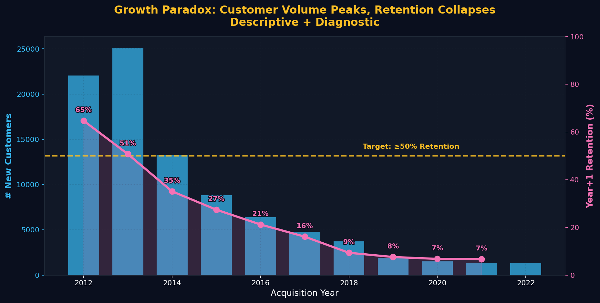
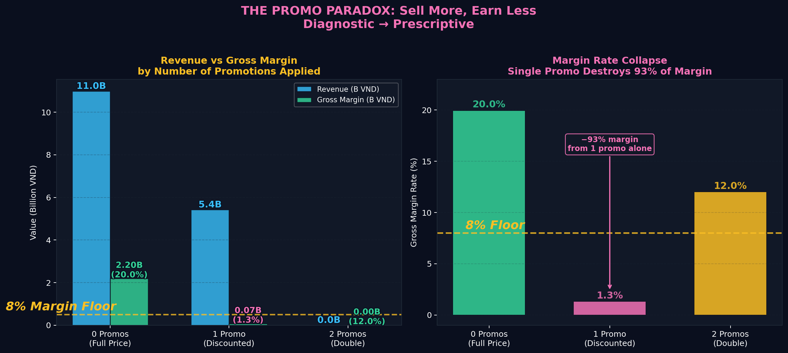
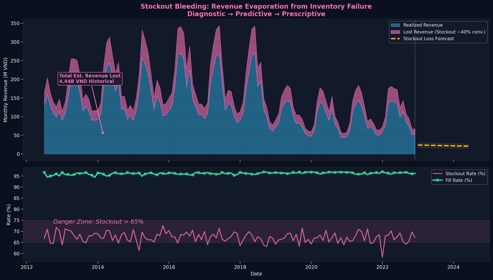

# Datathon 2026 — Team ReelScroller

> **Team**: ReelScroller | **Task**: Phân tích dữ liệu kinh doanh (Part 2) và Dự đoán doanh thu (Revenue) cùng giá vốn (COGS) hàng ngày giai đoạn 01/01/2023 – 01/07/2024 (Part 3).

Dự án này chứa toàn bộ mã nguồn, biểu đồ và báo cáo cho cuộc thi VinUni Datathon 2026. Code được thiết kế với đường dẫn tương đối (relative paths) thông qua `pathlib`, đảm bảo Ban Giám Khảo có thể dễ dàng chạy lại trên bất kỳ máy tính nào mà không cần sửa code.

---

## 📂 Cấu trúc Repository

```text
vin_datathon/
├── README.md                           # Hướng dẫn tổng quan (file này)
├── data/                               # ⬅️ Đặt toàn bộ 15 file raw CSVs ở đây
│   ├── sales.csv
│   ├── promotions.csv
│   └── ... 
├── part2-DA/                           # Phần 2: Data Analysis & Strategy
│   ├── Latex/                          # Source code báo cáo LaTeX
│   ├── charts/                         # 22+ biểu đồ phân tích chuyên sâu
│   └── src/                            # Code Python sinh biểu đồ EDA
└── part3-revenue-forecasting-pipeline/ # Phần 3: Machine Learning Pipeline
    ├── run_all.py                      # 🚀 Chạy 1 lệnh duy nhất để sinh file nộp
    ├── src/                            # Source code (FE, Training, Post-process)
    ├── output/                         # Chứa file submission.csv và mô hình
    └── docs/                           # Tài liệu giải thích kỹ thuật
```

---

## 📊 Phần 2: Phân tích Dữ liệu (Data Analysis)

Chúng tôi đã thực hiện phương pháp tiếp cận **Descriptive $\to$ Diagnostic $\to$ Predictive $\to$ Prescriptive** để bóc tách các điểm thất thoát doanh thu (Revenue Leakage). 

Dưới đây là một số Insight nổi bật được trích xuất từ `part2-DA/charts`:

### 1. The Growth Paradox (Khủng hoảng giữ chân khách hàng)

*Lượng khách mới đạt đỉnh năm 2013 nhưng tỷ lệ giữ chân khách hàng năm tiếp theo đã lao dốc từ 65% xuống còn 7%.*

### 2. The Promo Paradox (Nghịch lý khuyến mãi)

*Chỉ một chương trình khuyến mãi duy nhất có thể thổi bay biên lợi nhuận từ 20.0% xuống còn 1.3% — phá hủy 93% lợi nhuận.*

### 3. Stockout Bleeding (Chảy máu doanh thu do đứt gãy tồn kho)

*Mặc dù tỷ lệ lấp đầy (fill rate) báo cáo là 96%, nhưng tỷ lệ hết hàng (stockout rate) thực tế trên SKU lên tới 67%, gây thất thoát 4.44 tỷ VND.*

*(Vui lòng xem toàn bộ 22 biểu đồ chi tiết trong thư mục `part2-DA/charts/` và báo cáo PDF)*

---

## 🤖 Phần 3: Revenue Forecasting Pipeline (Dự đoán doanh thu)

Pipeline Machine Learning được tối ưu hóa cho độ chính xác cao nhất trên Leaderboard Kaggle, sử dụng kiến trúc Ensemble giữa **LightGBM** và **XGBoost**.

### ⚙️ Thiết kế Reproducibility (Dành cho Ban Giám Khảo)

Tất cả các file Python trong `part3-revenue-forecasting-pipeline/src/` đều đã được cài đặt tự động nhận diện thư mục gốc bằng đoạn code:
```python
from pathlib import Path
BASE_DIR = Path(__file__).resolve().parent.parent
DATA     = BASE_DIR.parent / "data"
OUT      = BASE_DIR / "output"
```
**BGK không cần sửa bất kỳ đường dẫn cứng (hardcoded path) nào!** Chỉ cần đảm bảo thư mục `data/` nằm cùng cấp với `part3-revenue-forecasting-pipeline/`.

### 🚀 Hướng dẫn chạy Pipeline

**Bước 1: Cài đặt thư viện**
```bash
pip install pandas numpy lightgbm xgboost scikit-learn scipy pyarrow matplotlib
```

**Bước 2: Nạp dữ liệu**
Copy **tất cả 15 file CSV** từ thư mục đề bài vào thư mục `vin_datathon/data/`.

**Bước 3: Chạy Pipeline**
Mở terminal, di chuyển vào thư mục Part 3 và chạy file tổng:
```bash
cd part3-revenue-forecasting-pipeline
python run_all.py
```

Pipeline sẽ tự động chạy qua 3 bước (tổng thời gian ~3 phút):
1. **Feature Engineering**: Tạo 55 features từ dữ liệu thô (Pre-COVID regime).
2. **Model Training**: Huấn luyện LightGBM & XGBoost qua Walk-forward CV.
3. **Post-Processing**: Blend tỷ lệ 50/50 ML+SS và tự động tạo `submission.csv` vào thư mục `output/`.

---

## 🔑 Key Methodology Highlights

1. **Pre-COVID Training:** Loại bỏ dữ liệu 2020-2021 (doanh thu giảm 50-70%) để tránh Data Distribution Shift làm nhiễu mô hình cho giai đoạn bình thường (2023-2024).
2. **Walk-Forward Validation:** Không dùng K-Fold ngẫu nhiên. Validation split hoàn toàn theo trục thời gian để chống rò rỉ dữ liệu (Data Leakage).
3. **Ensemble & Calibration:** Kết hợp sức mạnh non-linear của LightGBM/XGBoost với tính ổn định mùa vụ của Sample Submission.

*Chi tiết phương pháp và siêu tham số xem tại `part3-revenue-forecasting-pipeline/docs/methodology.md` và `src/config.py`.*
