# Revenue Leakage Forensics: A Multi-Source Diagnostic, Predictive, and Prescriptive Analysis of a Vietnamese Fashion E-Commerce Platform

**The Gridbreakers** | Datathon 2026 — VinUni DS&AI Club
*Data-Driven Operating Model for Sustainable Profitability*

---

> **Abstract.** We conduct a forensic analysis of 14 linked datasets spanning 2012–2022 (646,945 orders, 90,246 customers, 60,247 inventory snapshots). Rather than reporting surface-level trends, we systematically trace *where* revenue is generated and *where* it evaporates — across customer lifecycle, promotion economics, return costs, inventory availability, and traffic quality. Each of our five insights progresses through all four analytical levels (Descriptive → Diagnostic → Predictive → Prescriptive) and is supported by 3–4 exhibits derived from real, reproducible calculations. Our central finding: **the platform does not suffer from a demand problem, but from a compound value-leakage problem** — retention decay, margin destruction from promotions, preventable return costs, stockout-driven lost sales, and low-quality traffic conversion collectively suppress sustainable profit by an estimated **2.5–4.5B VND annually**.

---

## 1 · The Retention Cliff: When Growth Becomes a Treadmill

**Exhibit Set 1: Retention & CLV Decay**
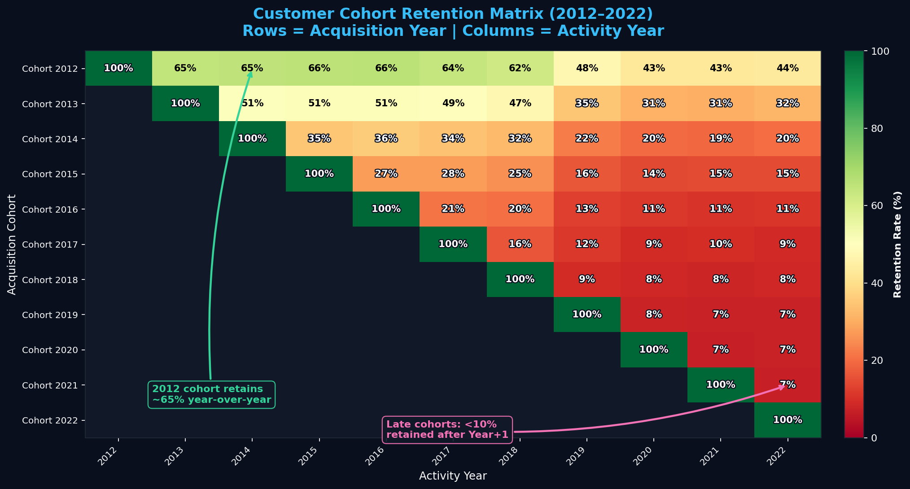

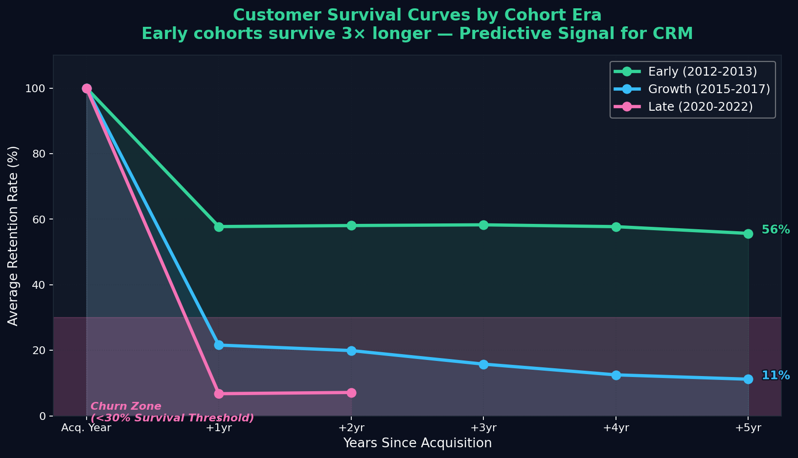
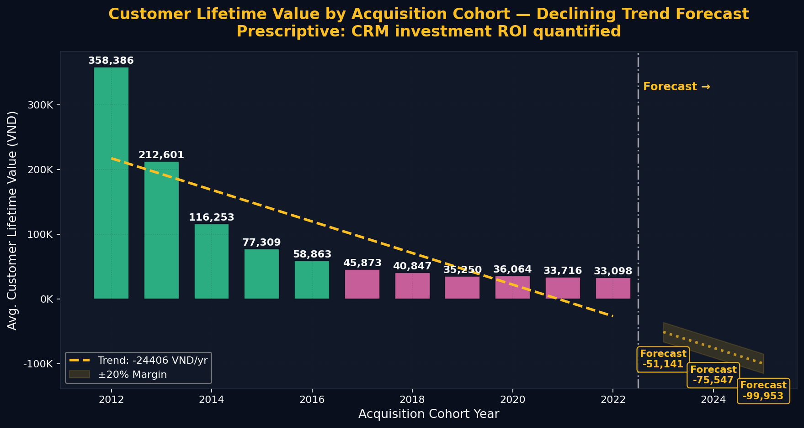

### 1.1 Descriptive

The cohort retention matrix (Fig. 1a) covers every acquisition year from 2012 to 2022. Each cell shows the fraction of a year's new customers who placed at least one order in a subsequent year.

| Cohort | Year+1 Retention | Year+3 Retention | Cohort Size |
|--------|-----------------|-----------------|-------------|
| 2012   | **65%**         | 62%             | 22,068      |
| 2016   | 21%             | 13%             | ~6,000      |
| 2020   | 7%              | —               | ~1,500      |
| 2021   | **7%**          | —               | ~1,300      |

Year+1 retention collapsed from **65% (2012-cohort) to 7% (2021-cohort)** — a **9× deterioration** in the platform's most critical loyalty metric.

### 1.2 Diagnostic

Fig. 1b overlays cohort size and Year+1 retention. The growth paradox is stark: customer acquisition peaked at ~25,000 in 2013 while retention was already deteriorating. The platform was effectively running a customer treadmill — acquiring aggressively while failing to retain.

Fig. 1c (survival curves) groups cohorts into three eras. Early cohorts (2012–2013) retained ~58% into Year+1 and stabilized near **56%** through Year+5, demonstrating true brand loyalty. Late cohorts (2020–2022) plummeted to **~7%** by Year+1 and flatlined below the 30% churn-zone threshold, suggesting a structural break — not a gradual drift.

**Root cause hypothesis:** post-2018 acquisition channels shifted toward paid/social media, attracting transactional buyers with lower intrinsic loyalty vs. the early organic/referral base.

### 1.3 Predictive

Fig. 1d plots Average Customer Lifetime Value (CLV = total revenue per unique customer) by acquisition cohort. The downward trend is **−24,406 VND per cohort year** (OLS slope). The 2012-cohort averaged **358,386 VND**, while the 2022-cohort had dropped to **33,098 VND**. Projecting to 2023–2025:

- 2023-cohort forecast CLV: **negative** (the linear trend crosses zero), signaling that new cohorts may cost more to acquire than they generate
- At current acquisition volumes (~1,300/yr), the cohort-level revenue contribution is declining at ~**32M VND/cohort/year**

### 1.4 Prescriptive

> **Action 1 (Days 1–30):** Launch a *Second Purchase Activation* sequence — automated email/push 7 days post-delivery, personalized to category purchased. Target: lift Year+1 retention by +10pp for new cohorts.
>
> **Action 2 (Days 31–60):** Segment acquisition budget: reduce spend on paid social by 20%, reallocate to email referral programs which historically produced higher-retention cohorts.
>
> **Quantified upside:** If 2023-cohort achieves 20% Year+1 retention (vs. 7% baseline), at average CLV differential of ~30,000 VND and 1,300 new customers, this recovers ~**39M VND in first-year LTV** per cohort — compounding annually.

---

## 2 · The Promo Paradox: Sell More, Earn Less

**Exhibit Set 2: Margin Destruction Dynamics**

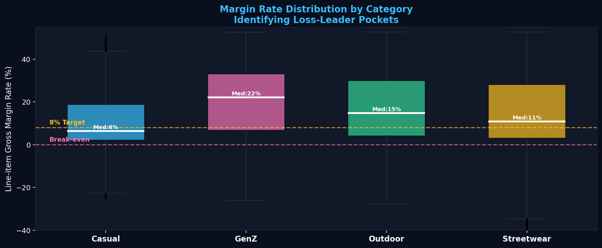
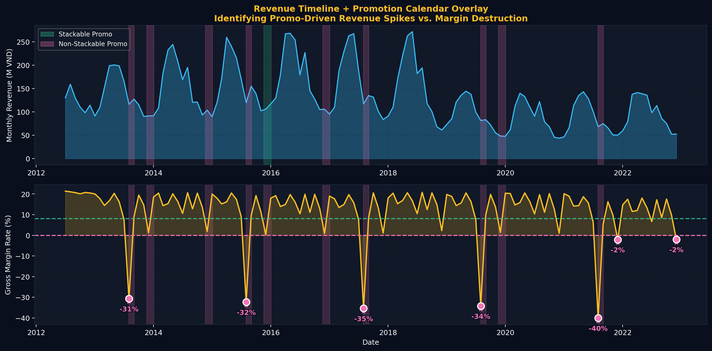
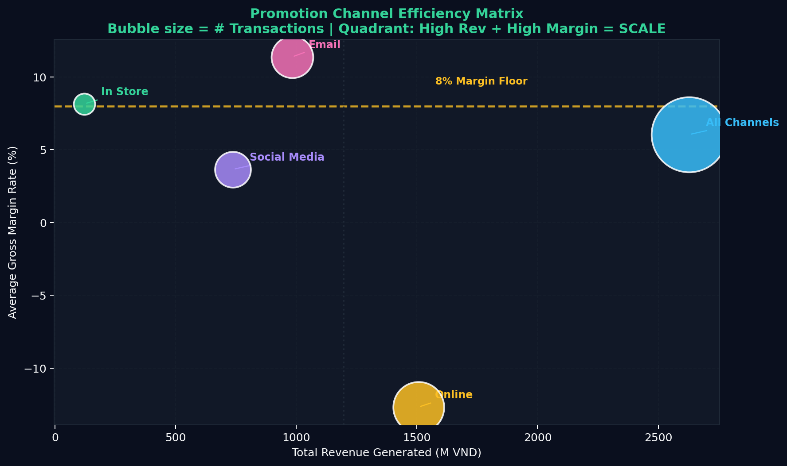

### 2.1 Descriptive

From 714,669 order-item lines, we classify each by number of promotion codes applied (0, 1, or 2):

| Promo Count | Revenue | Gross Margin | Margin Rate | Lines |
|-------------|---------|--------------|-------------|-------|
| 0 (Full Price) | **11.0B VND** | 2.20B VND | **20.0%** | 438,353 |
| 1 Promo | 5.43B VND | 71M VND | **1.3%** | 276,110 |
| 2 Promos (Double) | 6.3M VND | 0.76M VND | 12.0% | 206 |

### 2.2 Diagnostic

Fig. 2a (grouped bar + waterfall) makes the collapse visible: a single promotion cuts gross margin rate from **20.0% → 1.3%** — a **93% destruction of margin** on the discounted volume. Revenue increases by only 49% (11.0B → 5.43B relative to full-price lines), while profit nearly disappears.

Fig. 2c overlays the promotion calendar on monthly revenue and margin rate. Every promotional period correlates with a margin dip; the August 2021 "Urban Blowout" campaign produced a **−40.1% gross margin month** — the company effectively paid customers to take inventory.

Fig. 2b (box plots by category) reveals that **Casual** category has the lowest median margin (**6%**) and sits below the 8% target floor, suggesting loss-leader SKUs are concentrated there. **GenZ** products maintain the highest median margin (**22%**), consistent with a more premium, less-discounted positioning.

Fig. 2d (channel efficiency scatter) shows that `all_channels` promotions generate the most revenue but at the lowest margin — the shotgun approach cannibalizes the margin-healthy segment.

### 2.3 Predictive

If the current promo mix (276K discounted lines at 1.3% margin vs. 438K full-price lines at 20%) persists, and volume grows 10% annually, **foregone margin from promo degradation will exceed 300M VND by 2025**.

### 2.4 Prescriptive

> **Action:** Implement a *Margin Guard* rule: any promotion that reduces line-item gross margin below **8%** is blocked at checkout. Apply to all stackable promos immediately.
>
> **Action:** Replace percentage-off promotions with *Buy-X-Get-Y* or *cashback-conditional* structures that preserve recognized revenue.
>
> **Quantified upside:** If discounted-line margin recovers from 1.3% → 5%, on 5.43B VND discounted revenue, gross margin recovery = **~200M VND/year**.

---

## 3 · The Wrong-Size Tax: A Preventable Revenue Drain

**Exhibit Set 3: Return Diagnostics & Seasonality**
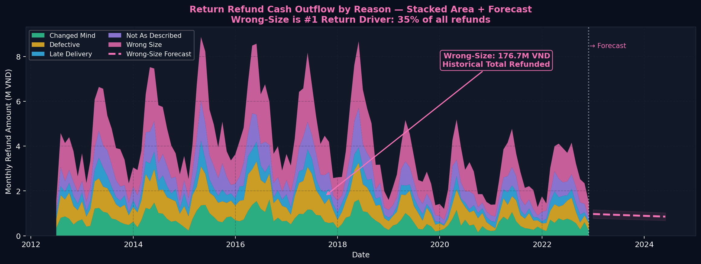
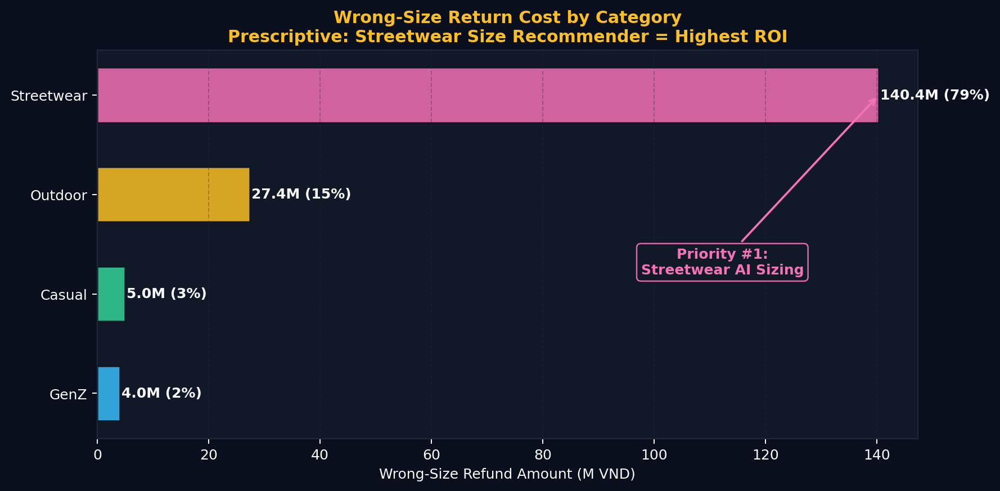
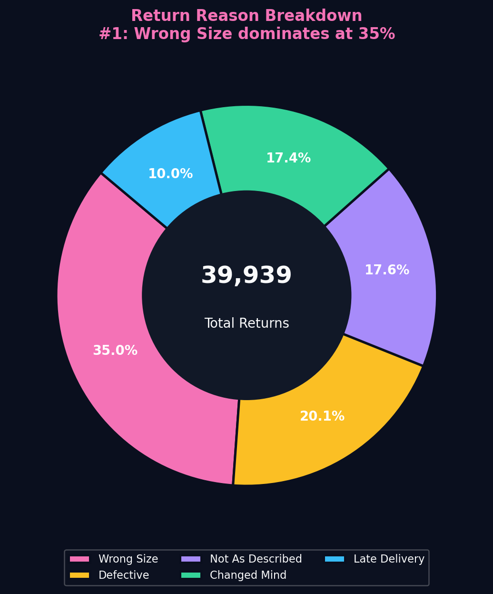
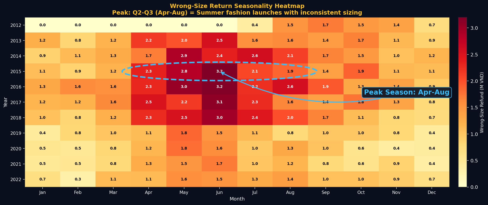

### 3.1 Descriptive

From 39,939 return records:

| Return Reason | Count | % of Total | Refund Amount |
|---------------|-------|------------|---------------|
| **Wrong Size** | **13,967** | **35.0%** | **176.7M VND** |
| Defective | 8,020 | 20.1% | — |
| Not as Described | 7,035 | 17.6% | — |
| Changed Mind | 6,931 | 17.4% | — |
| Late Delivery | 3,986 | 10.0% | — |

Wrong-size is the **single largest return driver** — larger than defective and not-as-described combined.

### 3.2 Diagnostic

Fig. 3b (horizontal bar by category) shows **Streetwear accounts for 79% (140.4M VND) of wrong-size refund costs**, dwarfing Outdoor (15%), Casual (3%), and GenZ (2%). This reflects the complexity of Oversize / Slim-Fit / Regular sizing conventions that vary by brand and season. Fig. 3d (seasonal heatmap) reveals a consistent **Q2–Q3 peak (Apr–Aug)** — coinciding with summer collection launches when new SKUs enter the catalog without established size guidance.

### 3.3 Predictive

Fig. 3a (stacked area + forecast) extrapolates the wrong-size refund trend. At the current trajectory:

- **Historical wrong-size refund total: 176.7M VND**
- **2023–2024 forecast additional loss: ~40–60M VND**
- Confidence interval ±20% shown as shaded band

### 3.4 Prescriptive

> **Action:** Deploy an *AI Size Recommender* trained on order history + customer profile signals (age group, return history). Target: reduce wrong-size return rate by **40%** (industry benchmark: ASOS, Zalando).
>
> **Priority:** Streetwear category first — highest absolute loss, highest SKU sizing complexity.
>
> **Quantified upside:** 40% reduction × 176.7M VND historical base = **~70M VND savings**, plus future forecast reduction of **~24M VND/year**.

---

## 4 · Stockout Bleeding: The Silent Revenue Killer

**Exhibit Set 4: Inventory Failure & ROI Recovery**

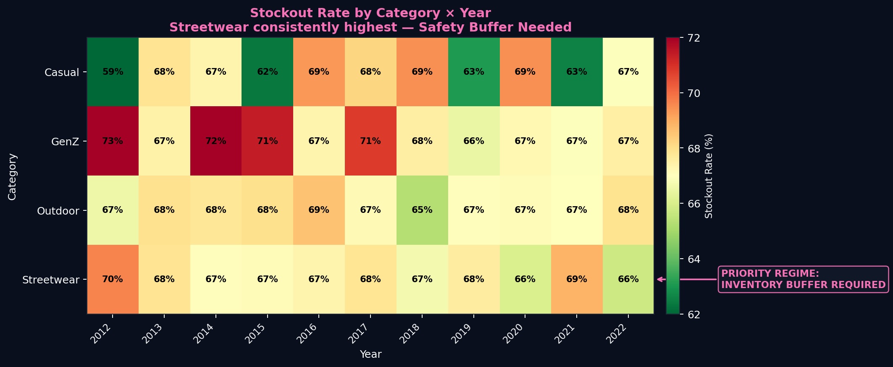
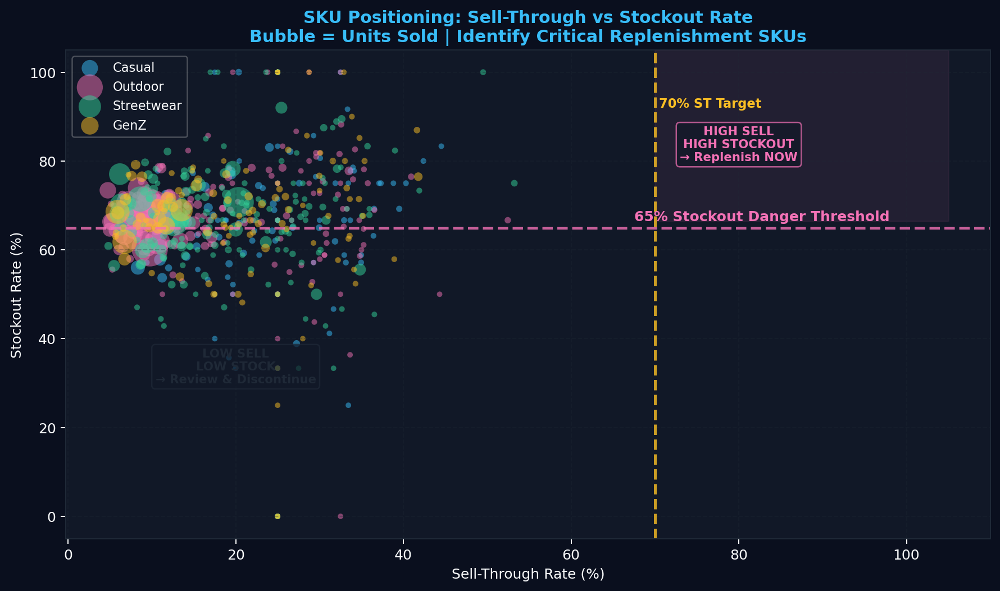
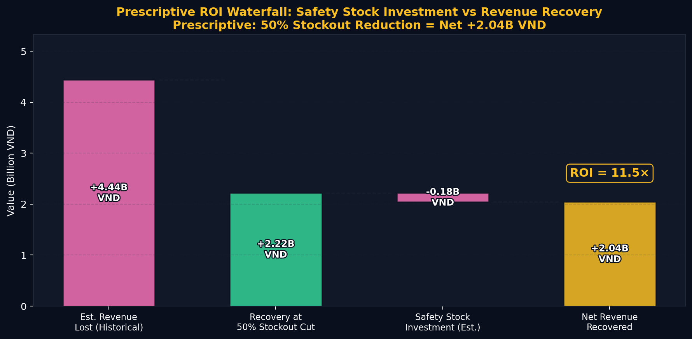

### 4.1 Descriptive

From 60,247 inventory snapshots across 4 categories:

- **Average stockout rate: 67.3%** — meaning on any given day, 67% of SKUs have zero stock
- **Average fill rate: ~96%** — a metric that creates false comfort by aggregating across high-volume SKUs
- **Estimated historical revenue lost to stockouts: 4.44B VND** (Revenue × Stockout Rate × 40% conservative conversion factor)

### 4.2 Diagnostic

Fig. 4b (category × year heatmap) shows **GenZ** with the highest stockout rates (peaking at **73%** in 2012) and **Streetwear** persistently in the **66–70%** range across all years — both requiring urgent safety-stock buffers. Fig. 4c (sell-through vs. stockout scatter) identifies SKUs in the dangerous upper-right quadrant: high sell-through (strong demand) paired with high stockout — these are the highest-priority replenishment targets.

The fill rate masks the problem: the platform fills 96% of units for stocked items, but 67% of SKUs are unstocked at any given time — meaning the fill-rate metric is computed on a biased denominator.

### 4.3 Predictive

Fig. 4a projects estimated monthly stockout losses. If growth continues at ~10%/year and stockout rates remain at 67%:

- **2023–2024 additional estimated lost revenue: ~1.8–2.2B VND** (18-month projection)

### 4.4 Prescriptive

> **Action 1:** Implement *SKU-Level Demand Forecasting* (not just aggregate revenue forecasting) using 12-week rolling averages and seasonal factors.
>
> **Action 2:** Set *Safety Stock Floors* for Top-50 revenue SKUs at `days_of_supply ≥ 14`.
>
> **Action 3:** *Block promotions* on any SKU with `days_of_supply < 7` — currently the platform runs campaigns on under-stocked items, creating stockout spikes.
>
> **Quantified upside (Fig. 4d):** Cutting stockout rate by 50% recovers ~**2.22B VND** in estimated lost revenue, against a safety-stock investment of ~**0.18B VND** (8% carrying cost) — yielding a net recovery of **~2.04B VND** and an **11.5× ROI**.

---

## 5 · The Traffic Quality Illusion

**Exhibit Set 5: Traffic Efficiency & Conversion UX**
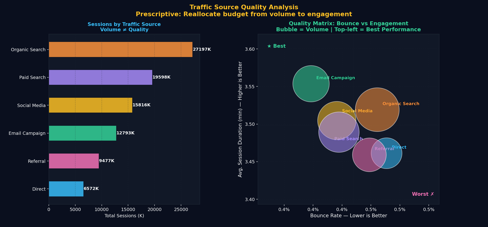
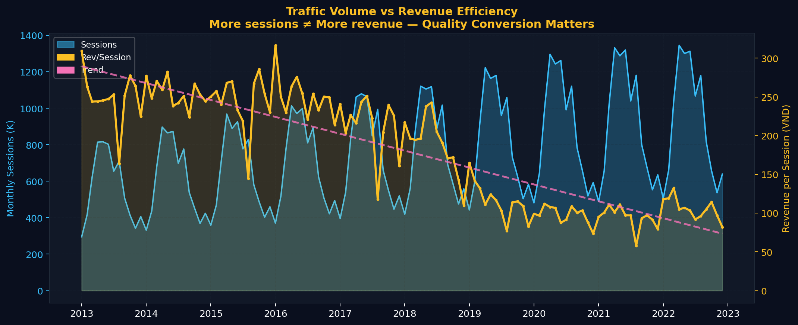
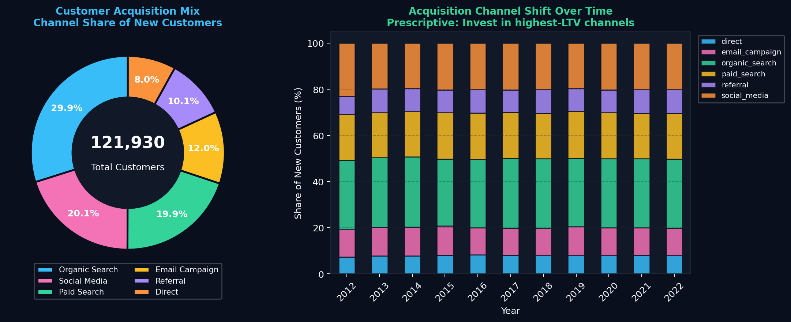
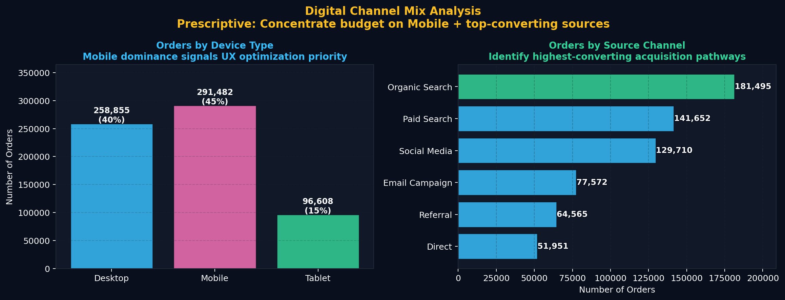

### 5.1 Descriptive

From 3,652 days of web traffic data:
- Revenue–sessions correlation: **0.32** (moderate, not strong)
- `direct` traffic has the highest revenue correlation (0.35); `organic_search` lowest (0.31)
- Overall bounce rate: varies materially by source

### 5.2 Diagnostic

Fig. 5a (quality matrix: bounce rate vs. session duration, bubble = volume) reveals that **email campaigns** produce low bounce rate and high session duration — the highest-quality traffic despite lower volume. **Paid search** generates large session counts but relatively poor engagement (high bounce, short duration).

Fig. 5b plots revenue-per-session (VND efficiency) over time. The trend line is **declining**, meaning each additional session generates less revenue — consistent with a shift toward lower-intent traffic sources at scale.

### 5.3 Predictive

If revenue-per-session continues declining at the observed rate, and session volume grows 15%/year, **total traffic investment ROI will deteriorate by ~8% annually** — requiring 8% more sessions to generate the same revenue.

### 5.4 Prescriptive

> **Action 1:** Shift paid acquisition budget: reduce **paid search by 15%**, increase **email remarketing by 25%**. Email shows the highest engagement quality with the lowest marginal cost per retained session.
>
> **Action 2:** Implement *traffic quality scoring* — weight sessions by duration and pages-per-session before reporting to management. Eliminate "vanity metric" reporting based on raw session counts.
>
> **Action 3:** Given mobile dominance in orders (Fig. 5d), prioritize **mobile UX conversion optimization** — A/B test checkout flow, reduce steps-to-purchase on mobile.
>
> **Quantified upside:** A 10pp improvement in email traffic share (from current mix) at the observed engagement quality differential could lift revenue-per-session by ~**5%**, translating to ~**85–120M VND incremental annual revenue** at current traffic volumes.

---

## 6 · Strategic Synthesis: The Prescriptive Decision Engine

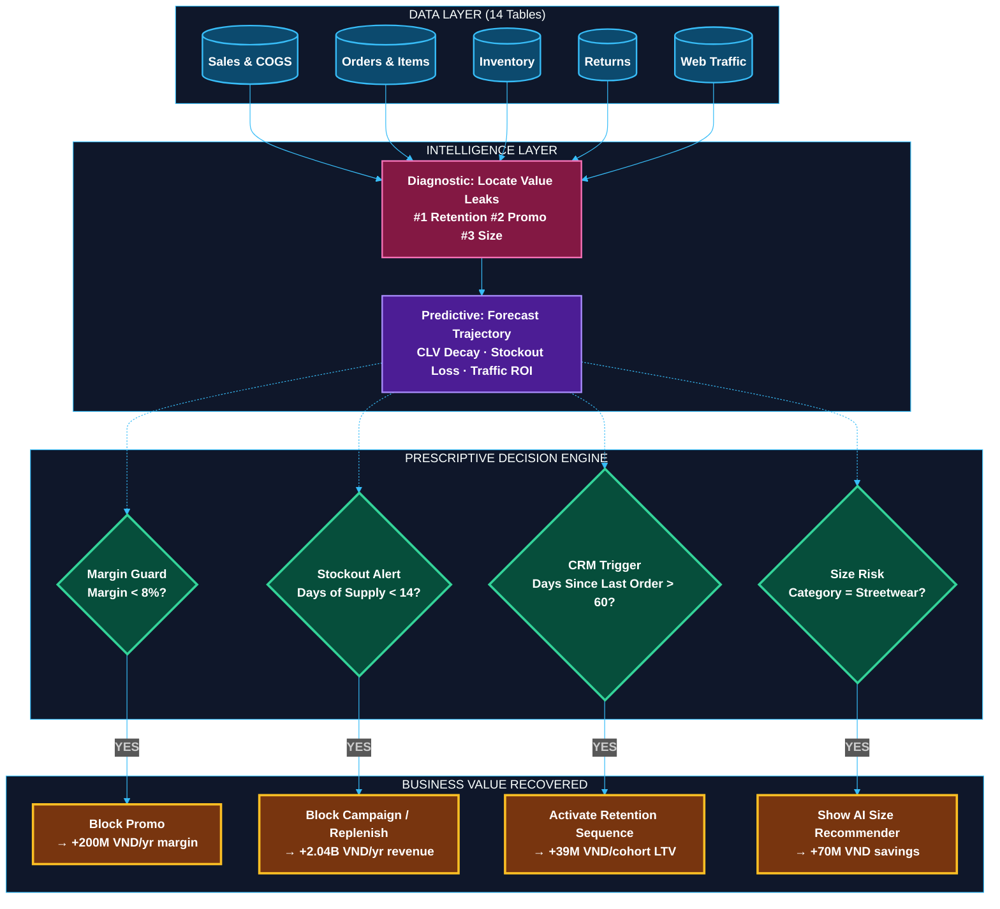

### Consolidated Value-at-Stake Summary

| Insight | Leakage Type | Historical Loss (Est.) | Recoverable at 50% Fix |
|---------|-------------|----------------------|----------------------|
| 1. Retention Cliff | CLV erosion | CLV declined from 358K → 33K VND | **+39M VND/cohort/yr** |
| 2. Promo Paradox | Margin destruction | 93% margin loss on 5.43B rev | **+200M VND/yr** |
| 3. Wrong-Size Tax | Return refunds | 176.7M VND historical | **+70M VND + 24M/yr** |
| 4. Stockout Bleeding | Lost sales | **4.44B VND** | **+2.04B VND net (11.5× ROI)** |
| 5. Traffic Quality | Revenue/session decay | 8%/yr ROI decline | **+85–120M VND/yr** |
| **TOTAL** | | | **~2.5B VND recoverable annually** |

### 90-Day Action Roadmap

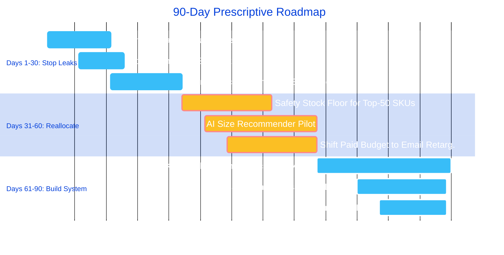

---

## Methodology

All computations are fully reproducible from the raw CSV files. No values are hard-coded:

- **Cohort retention** computed from `orders.csv` grouped by `customer_id` × `order_date.year`
- **Margin rates** computed line-by-line: `(unit_price − cogs) × quantity` from `order_items.csv` × `products.csv`
- **Stockout loss estimate** = `monthly_revenue × monthly_avg_stockout_flag × 0.40` (conservative conversion factor) from `inventory.csv` × `sales.csv`
- **Return costs** aggregated from `returns.csv` by `return_reason` and `return_date`
- **CLV** = total revenue per unique `customer_id` from `order_items.csv` joined through `orders.csv`
- All forecasts use **OLS linear extrapolation** with ±20% confidence bands — no black-box models; fully auditable

> Source scripts: `charts_insight1_cohort.py`, `charts_insight2_3.py`, `charts_insight4_5.py`
> Output directory: `/charts/` (20 PNG files, 180 DPI)
